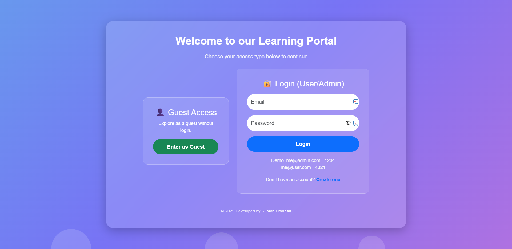
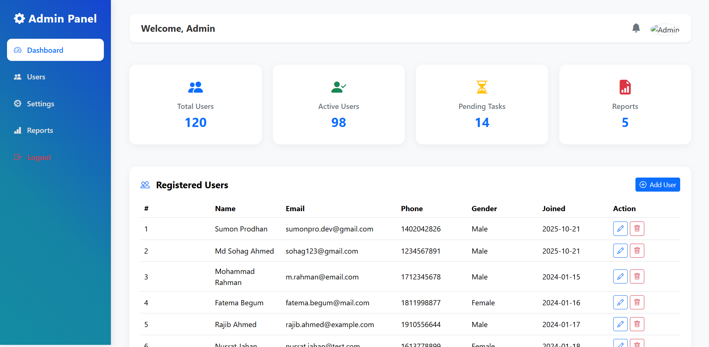

# 🧑‍💻 PHP User Management System

A simple and responsive **User Management System** built using **PHP** and **MySQL**, featuring user registration, login, and role-based dashboards for **Admin**, **User**, and **Guest**.

---

## 🚀 Features

- ✅ **User Registration** with validation  
- 🔐 **Secure Login System** (hashed password support)  
- 🧑‍🏫 **Role-Based Access Control** (Admin, User, Guest)  
- 📊 **Admin Dashboard** – Manage users and view system stats  
- 👤 **User Dashboard** – Personalized view for logged-in users  
- 👥 **Guest Dashboard** – Limited access for guests  
- 📁 **Database Integration** using MySQL  
- 🎨 **Responsive Design** with HTML, CSS, and Bootstrap  
- 🧩 **Session Handling & Logout System**

---

---

## 🛠️ Technologies Used

| Technology | Purpose |
|-------------|----------|
| **PHP** | Server-side scripting |
| **MySQL** | Database management |
| **HTML5** | Structure |
| **CSS3 / Bootstrap** | Styling and responsive design |
| **JavaScript** | Interactivity |

---

## ⚙️ Setup Instructions

1. **Clone or Download** the project folder.  
2. Move it into your local server’s directory (e.g. `www` for laragon).  
3. Create a database in **phpMyAdmin** (e.g. `demo_project`).  
4. Import the provided SQL file (if available).  
5. Update database credentials in `config.php`.  
6. Run the project in your browser:  `http://localhost:3000/index.php`

---

## 🔒 Login Roles Example

| Role | Email | Password |
|------|--------|----------|
| Admin | me@admin.com | 1234 |
| User | me@user.com | 4321 |
| Guest | NA | NA |

---

## 📸 Preview to Login Page

---

## 📸 Preview to Admin Dashboard

---

## 🧠 Author

**Sumon Prodhan**  
📧 Email: [sumonpro.dev@gmail.com]  
🌐 Portfolio: [Sumon Prodhan](https://sumonprodev.wixsite.com/sumonprodhan)  
💻 GitHub: [github.com/sumonprodhan](https://github.com/sumonprodhan)

---

## 🪪 License

This project is open-source and available under the **MIT License**.

---

### ⭐ If you like this project, give it a star on GitHub!
